# Unity Generic Palette

`Unity Generic Palette` は、`Color` や `TextStyle` のような共通設定を `PaletteAsset` と `PaletteProfileAsset` に分離し、`Profile` 単位でまとめて切り替えられるようにするライブラリです。

UI テーマの切り替えだけでなく、言語差し替え、イベント状態差し替え、Addressables を使った遅延ロードまで、同じ `EntryId` ベースの流れで扱えるように設計しています。

<p align="center">
  
</p>

`PaletteAsset` で「何を切り替えるか」を定義し、`PaletteProfileAsset` で「その Profile では何の値を使うか」を持たせ、`PaletteEngine` と各 `Applier` が再反映を担当します。結果として、同じ `EntryId` を参照している UI やコンポーネントを、`Profile` の変更だけでまとめて更新できます。

## Features

- `PaletteAsset` に `EntryId` 集合を定義し、値の参照先を安定化できる
- `PaletteProfileAsset` で `Profile` ごとの実値を分離できる
- `PaletteEngine` が `Profile` 切り替えと再反映通知を一元管理する
- `Included ProfileAsset` と外部 `Loader` の両方を同じ API で扱える
- `ProfileAsset` を動的にロード / アンロードする前提で扱えるため、言語切り替えのようにアセットを読み分けたいケースにも適している
- `ProfileId -> GUID` の対応表を Editor が自動同期する
- Addressables 利用時は `GuidBaseAddressablesLoader` を使って GUID ベースでロードできる
- `PaletteAsset` と `ProfileAsset` が疎結合なため、Profile ごとのアセットを独立して管理しやすく、Addressables への分離運用とも相性がよい
- 組み込みの `Color` / `TMP TextStyle` / `Legacy TextStyle` / `Gradient` パレット型を用意している
- 組み込み `Applier` は `Graphic.color`、`TMP_Text`、`UnityEngine.UI.Text` に対応している

## Flow

1. `PaletteAsset` に `EntryId` を定義する
2. `PaletteProfileAsset` に `Profile` ごとの実値を入れる
3. `PaletteEngine` で現在の `Profile` を切り替える
4. 各 `Applier` が対応する `EntryId` の値を受け取り、対象コンポーネントへ反映する

## Package

- Package name: `com.daitokuamy.unitygenericpalette`
- Current version: `0.9.0`
- Unity: `6000.0` 以降

## Built-in Palette Types

| Palette Type | Value Type | Built-in Applier |
| --- | --- | --- |
| `ColorPaletteAsset` | `UnityEngine.Color` | `GraphicColorPaletteApplier` |
| `TextStylePaletteAsset` | `TextStylePaletteValue` | `TmpTextStylePaletteApplier` |
| `LegacyTextStylePaletteAsset` | `LegacyTextStylePaletteValue` | `LegacyTextStylePaletteApplier` |
| `GradientPaletteAsset` | `UnityEngine.Gradient` | なし |

`Gradient` はパレット化できますが、現時点では組み込み `Applier` は提供していません。

## Installation

### Install via Package Manager

Unity の `Window > Package Manager` を開き、`Add package from git URL...` から次を指定します。

```text
https://github.com/DaitokuAmy/unity-generic-palette.git?path=/Packages/com.daitokuamy.unitygenericpalette
```

タグを固定したい場合は末尾にバージョンを付けます。

```text
https://github.com/DaitokuAmy/unity-generic-palette.git?path=/Packages/com.daitokuamy.unitygenericpalette#0.9.0
```

### Install via manifest.json

```json
{
  "dependencies": {
    "com.daitokuamy.unitygenericpalette": "https://github.com/DaitokuAmy/unity-generic-palette.git?path=/Packages/com.daitokuamy.unitygenericpalette"
  }
}
```

## Quick Start

### 1. Open `PaletteEditorWindow` and create `PaletteAssetStorage`

まず `PaletteEditorWindow` を開きます。ここが `PaletteAsset`、`Entry`、`PaletteProfileAsset` をまとめて編集する起点です。

<p align="center">
  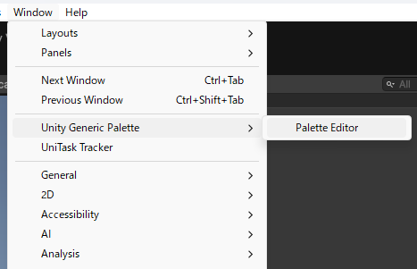
</p>

初回は `PaletteAssetStorage` が未設定なので、Window 上部に `Create Storage` ボタンが表示されます。まずはここから作成するのが一番分かりやすい導線です。

<p align="center">
  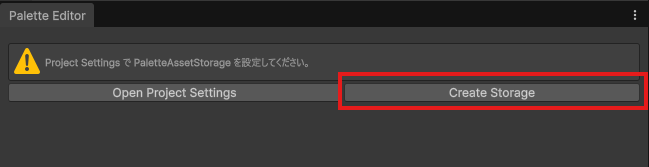
</p>

作成されるルートアセット:

- `PaletteAssetStorage`

このアセットは利用する `PaletteAsset` 一覧を保持します。必要ならあとから Project Settings の `Project/Unity Generic Palette` でも同じアセットを確認、差し替えできます。

### 2. Create palettes and profiles in `PaletteEditorWindow`

`PaletteEditorWindow` から次を行います。

- `PaletteAsset` の追加
- `Entry` の追加
- `PaletteProfileAsset` の追加
- `Profile Value` の編集
- `Default` の設定

次に `PaletteAsset` を追加します。パレット種別ごとに「どの値のまとまりを管理するか」をここで分けます。

<p align="center">
  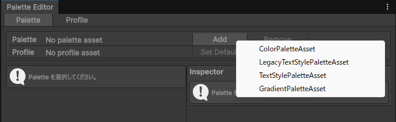
</p>

`PaletteAsset` を作ったら `Entry` を追加します。`EntryId` は実際に `Applier` 側から参照される識別子なので、後から見ても役割が分かる名前にしておくと運用しやすくなります。

<p align="center">
  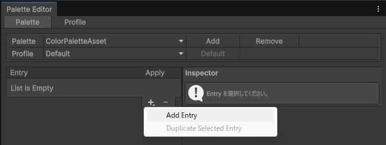
</p>

`Entry` を選ぶと Inspector で `EntryId`、表示名、説明を編集できます。README やチーム内運用で意味が伝わりやすいように、ここで最低限の説明を入れておくと便利です。

<p align="center">
  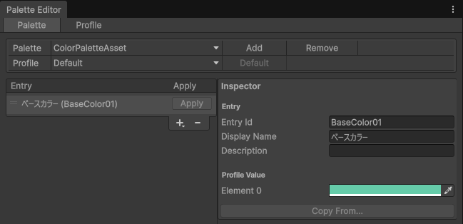
</p>

続いて `PaletteProfileAsset` を追加します。たとえば `Default`、`Light`、`Green` のように、切り替え単位ごとに Profile を分けます。

<p align="center">
  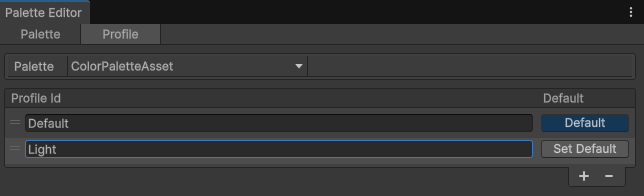
</p>

Profile を作成したら `Profile Value` を編集し、必要なら `Default` を設定します。値を書き換えることで、同じ `EntryId` に対して Profile ごとの差し替え内容を定義できます。

<p align="center">
  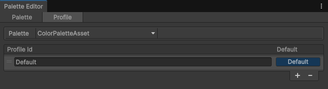
</p>

既存 Profile をベースに差分だけ作りたい場合は `Copy From...` が便利です。似たテーマや言語バリエーションを増やすときに、編集開始地点をそろえられます。

<p align="center">
  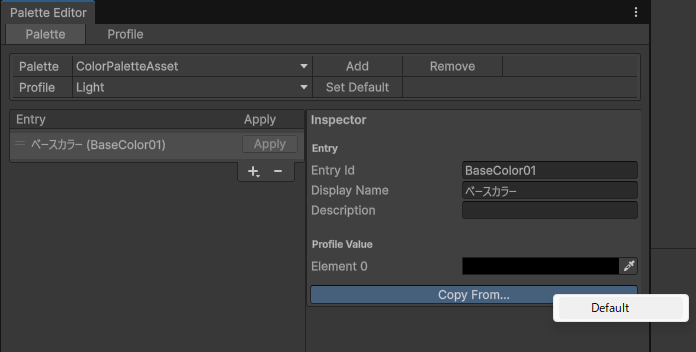
</p>

重要な Editor 仕様:

- Profile リストを選択しただけでは preview は切り替わりません
- Profile Popup を選択しただけでも preview は切り替わりません
- `Default` を設定したときだけ preview 用 current profile が更新されます

### 3. Place `PaletteEngine` in the scene

シーンに `PaletteEngine` を 1 つ配置し、次を設定します。

- Project Settings に `PaletteAssetStorage` が設定済みなら、`Palette Asset Storage` は追加時に自動設定されます
- `Palette Asset Storage`
- 必要なら `Dont Destroy On Load`
- 必要なら `Included ProfileAssets`

`Included ProfileAssets` に入れた Profile は Loader より優先されます。

### 4. Initialize at runtime

最小構成では、`Start` などから `PaletteEngine.InitializeAsync()` を呼びます。

`UniTask` 利用時の例:

```csharp
using Cysharp.Threading.Tasks;
using UnityEngine;
using UnityGenericPalette;

public sealed class PaletteBootstrap : MonoBehaviour {
    private void Start() {
        InitializeAsync().Forget();
    }

    private async UniTaskVoid InitializeAsync() {
        await PaletteEngine.InitializeAsync();
    }
}
```

`DefaultProfileId` が設定された Palette は、この初期化時に反映されます。

### 5. Add appliers

対象コンポーネントに組み込み `Applier` を追加し、`EntryId` を設定します。

- `GraphicColorPaletteApplier`
- `TmpTextStylePaletteApplier`
- `LegacyTextStylePaletteApplier`

`PaletteApplierBase` は現在の `Profile` を購読し、対応する `EntryId` の値を受け取ると `ApplyValue` を呼びます。

<table>
  <tr>
    <td align="center">
      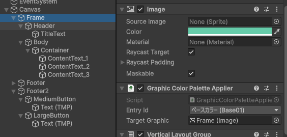<br>
      <sub>`Graphic.color` に色を反映する `GraphicColorPaletteApplier`</sub>
    </td>
    <td align="center">
      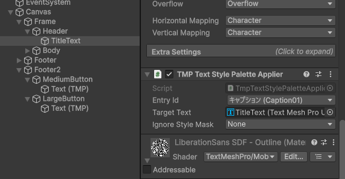<br>
      <sub>`TMP_Text` に書式を反映する `TmpTextStylePaletteApplier`</sub>
    </td>
  </tr>
</table>

`LegacyTextStylePaletteApplier` も同じ考え方で使えます。対象コンポーネントに `Applier` を追加し、監視したい `EntryId` を指定してください。

## Runtime API

主な API は次のとおりです。

- `PaletteEngine.InitializeAsync()`
- `PaletteEngine.SetLoader(IPaletteProfileLoader loader)`
- `PaletteEngine.ChangeProfileAsync<TProfileAsset>(string profileId)`
- `PaletteEngine.TryGetCurrentProfileId<TProfileAsset>(out string profileId)`

例:

```csharp
using Cysharp.Threading.Tasks;
using UnityEngine;
using UnityGenericPalette;

public sealed class LocaleSwitcher : MonoBehaviour {
    public async UniTask SwitchToJapaneseAsync() {
        await PaletteEngine.ChangeProfileAsync<TextStylePaletteProfileAsset>("Japanese");
    }
}
```

現在の `ProfileId` を確認したい場合:

```csharp
using UnityEngine;
using UnityGenericPalette;

public sealed class CurrentLocaleReporter : MonoBehaviour {
    private void Start() {
        if (PaletteEngine.TryGetCurrentProfileId<TextStylePaletteProfileAsset>(out var currentProfileId)) {
            Debug.Log(currentProfileId);
        }
    }
}
```

## Addressables Integration

Addressables を使う場合は、`GuidBaseAddressablesLoader` を利用できます。

前提:

- `com.unity.addressables` が入っていること
- Addressables Catalog から GUID で引けること

<p align="center">
  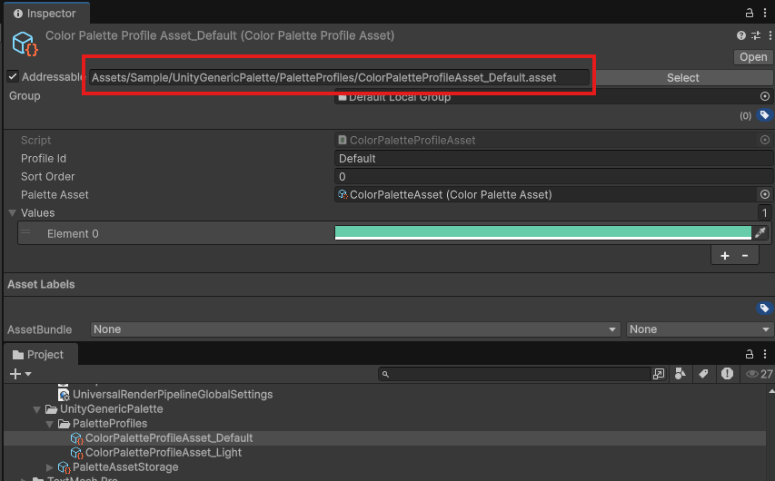
</p>

`PaletteProfileAsset` を Addressable にしたうえで、`PaletteAssetBase` に自動同期される `ProfileId -> GUID` 対応表を使って読み込みます。初期化順は `SetLoader` -> `InitializeAsync` -> `ChangeProfileAsync` を基本にすると分かりやすく運用できます。

サンプル:

```csharp
using Cysharp.Threading.Tasks;
using UnityEngine;
using UnityGenericPalette;

public sealed class PaletteBootstrap : MonoBehaviour {
    private void Start() {
        InitializeAsync().Forget();
    }

    private async UniTaskVoid InitializeAsync() {
        PaletteEngine.SetLoader(new GuidBaseAddressablesLoader());
        await PaletteEngine.InitializeAsync();
    }
}
```

`GuidBaseAddressablesLoader` は `PaletteAssetBase` にシリアライズされた `ProfileId -> GUID` 対応表を使って `Addressables.LoadAssetAsync<TProfileAsset>(guid)` を呼びます。

## Loader and GUID Synchronization

Editor は `PaletteProfileAsset` の作成・リネーム・削除・Project 変更時に `ProfileId -> GUID` 対応表を自動同期します。

同期対象:

- 欠損した参照
- 重複 `ProfileId`
- 古い GUID
- 空 `GUID`
- 孤立した `DefaultProfileId`

この対応表は、ランタイムが `AssetDatabase` なしで Loader に GUID を渡すために使われます。

## Extending with Custom Palettes

独自パレットを追加するときは、次の 3 つをそろえると流れが分かりやすくなります。

1. 値型を決める
2. `PaletteAsset` / `PaletteProfileAsset` を作る
3. 値を反映する `Applier` を作る

### 1. Decide the value type

まず「Profile ごとに何を切り替えたいか」を値型として決めます。`Color` や `float` のような単純な型でもよいですし、複数の値をまとめたい場合は `[System.Serializable]` な独自 struct でも構いません。

たとえば `Image.sprite` を差し替えたいなら、値型は `Sprite` です。

### 2. Create `PaletteAsset` and `PaletteProfileAsset`

`PaletteAsset` は `EntryId` の一覧を持つ定義アセット、`PaletteProfileAsset` は各 `EntryId` に対応する実値を持つアセットです。`PaletteAsset` 側には、対応する Profile 型を示す `[PaletteProfileAsset(...)]` 属性を付けます。

ファイルは分けて作ると管理しやすくなります。たとえば `Sprite` を切り替える独自パレットなら、次の 2 ファイルから始められます。

`SpritePaletteAsset.cs`

```csharp
using UnityGenericPalette;

namespace App.Palette {
    [PaletteProfileAsset(typeof(SpritePaletteProfileAsset))]
    public sealed class SpritePaletteAsset : PaletteAssetBase {
    }
}
```

`SpritePaletteProfileAsset.cs`

```csharp
using UnityEngine;
using UnityGenericPalette;

namespace App.Palette {
    public sealed class SpritePaletteProfileAsset : PaletteProfileAssetBase<SpritePaletteAsset, Sprite> {
    }
}
```

これだけで、`PaletteEditorWindow` から `SpritePaletteAsset` を追加し、`Entry` や `Profile` を編集できるようになります。

### 3. Create an `Applier`

ランタイムで値を実際のコンポーネントへ反映するには、`PaletteApplierBase<TPaletteAsset, TPaletteProfileAsset, TValue>` を継承した `Applier` を作ります。やることは基本的に `ApplyValue` の実装だけです。

`ImageSpritePaletteApplier.cs`

```csharp
using UnityEngine;
using UnityEngine.UI;
using UnityGenericPalette;

namespace App.Palette {
    [AddComponentMenu("App/Palette/Image Sprite Palette Applier")]
    [DisallowMultipleComponent]
    [RequireComponent(typeof(Image))]
    public sealed class ImageSpritePaletteApplier : PaletteApplierBase<SpritePaletteAsset, SpritePaletteProfileAsset, Sprite> {
        [SerializeField, Tooltip("Sprite を反映する Image コンポーネント")]
        private Image _targetImage;

        protected override void ApplyValue(Sprite value) {
            if (_targetImage == null) {
                return;
            }

            _targetImage.sprite = value;
        }

        protected override void OnValidateInternal() {
            AssignTargetImageIfNeeded();
        }

        private void Reset() {
            AssignTargetImageIfNeeded();
        }

        private void AssignTargetImageIfNeeded() {
            if (_targetImage != null) {
                return;
            }

            _targetImage = GetComponent<Image>();
        }
    }
}
```

`PaletteApplierBase` は現在の Profile 変更を購読し、設定された `EntryId` に対して `TryGetValueById` で値を取り出してくれます。独自 `Applier` 側では、受け取った値をどのコンポーネントへどう反映するかだけ考えれば十分です。

### 4. Use it in the editor

実装ができたら、使い方は組み込みパレットとほぼ同じです。

1. `PaletteEditorWindow` で新しい `PaletteAsset` を追加する
2. `EntryId` を定義する
3. その `PaletteAsset` に対応する `PaletteProfileAsset` を作る
4. Profile ごとに値を設定する
5. 対象 GameObject に独自 `Applier` を追加して `EntryId` を指定する

### 5. When you may need extra editor code

単純な `Color`、`float`、`Sprite`、`Gradient` のように Unity がそのまま表示できる型なら、上の 3 ステップだけで始められることが多いです。

次のような場合は追加実装を検討してください。

- 値型が複雑で Inspector 表示を整えたい場合: `PropertyDrawer`
- ランタイムで独自の取得元から Profile を読みたい場合: 独自 `Loader`
- 1 つの値を複数コンポーネントへまとめて適用したい場合: 専用 `Applier`

## Sample

サンプルアセットは次にあります。

- Scene: `Assets/Sample/Scenes/SampleScene.unity`
- Script: `Assets/Sample/Scripts/Sample.cs`
- Palette assets: `Assets/Sample/UnityGenericPalette`

サンプルでは `GuidBaseAddressablesLoader` を設定して `PaletteEngine.InitializeAsync()` を呼ぶ流れと、Profile を切り替えたときに複数の UI 要素へ変更が連動する様子を確認できます。

<p align="center">
  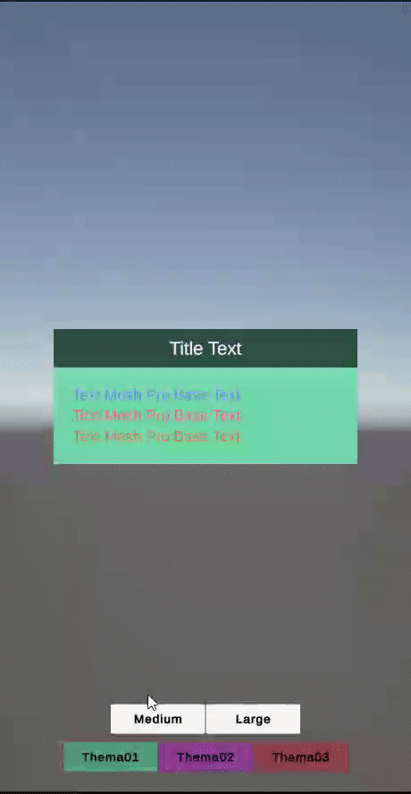
</p>

<p align="center">
  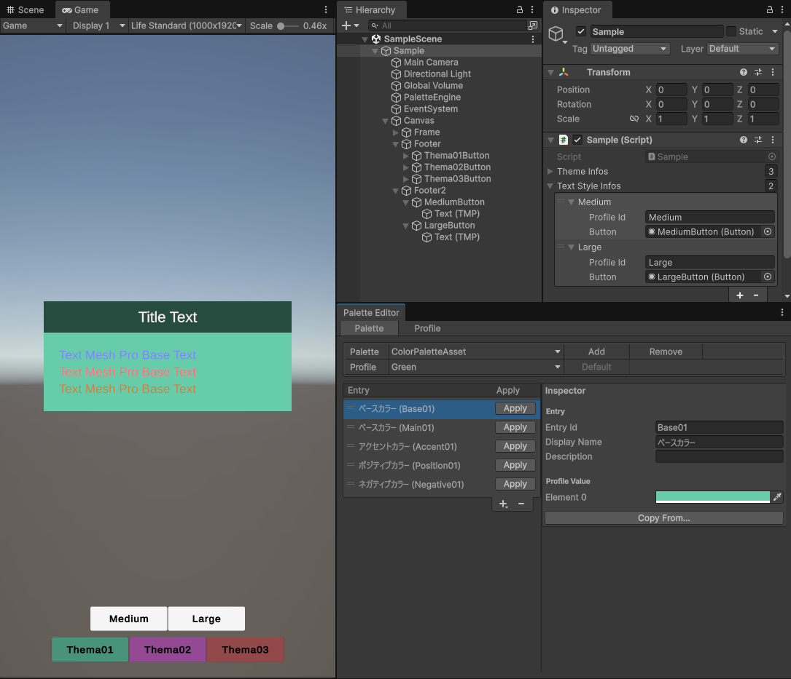
</p>

この画面を見ると、README の Quick Start とサンプル同梱アセットの対応を一度に追えます。`PaletteEditor` で `Profile` を切り替えながら、Game View 側で色や文字スタイルがどう変わるかを確認できます。

## Repository Layout

```text
Packages/com.daitokuamy.unitygenericpalette/
  Editor/
  Runtime/
Assets/Sample/
docs/specs/
```

- `Packages/com.daitokuamy.unitygenericpalette`
  - 配布対象の UPM パッケージ本体
- `Assets/Sample`
  - 動作確認用のサンプルアセット
- `docs/specs`
  - 実装寄りの仕様整理ドキュメント

## Limitations

- `Gradient` 用の組み込み `Applier` はまだありません
- Addressables Group の自動構成は行いません
- `Profile` の表示名や説明を別定義で持つ仕組みはまだありません

## License

MIT License
